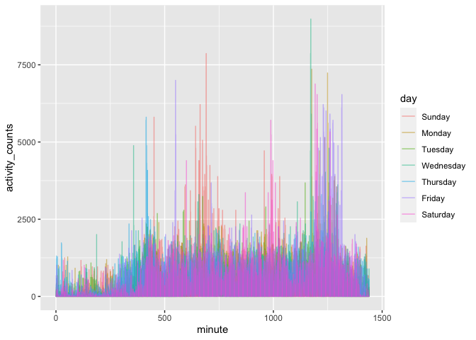

Homework 3
================
Chariz Seijo

Solution to HW 3.

## Problem 1

``` r
data("instacart")
```

This dataset contains 1384617 rows and 15 columns.

Observations are the levels of items in orders by user. There are
user/order variables, such as user ID, order ID, order day, and order
hour. There are also item variables, including name, aisle, department,
and some numeric codes.

**How many aisles, and which are most items from?**

``` r
instacart %>% 
  count(aisle) %>% 
  arrange(desc(n))
```

    ## # A tibble: 134 x 2
    ##    aisle                              n
    ##    <chr>                          <int>
    ##  1 fresh vegetables              150609
    ##  2 fresh fruits                  150473
    ##  3 packaged vegetables fruits     78493
    ##  4 yogurt                         55240
    ##  5 packaged cheese                41699
    ##  6 water seltzer sparkling water  36617
    ##  7 milk                           32644
    ##  8 chips pretzels                 31269
    ##  9 soy lactosefree                26240
    ## 10 bread                          23635
    ## # … with 124 more rows

**Make a plot\!**

``` r
instacart %>% 
  count(aisle) %>% 
  filter(n > 10000) %>% 
  mutate(
    aisle = factor(aisle),
    aisle = fct_reorder(aisle, n)
  ) %>% 
  ggplot(aes(x = aisle, y = n)) +
  geom_point() +
  theme(axis.text.x = element_text(angle = 90, vjust = 0.5, hjust=1))
```

<!-- -->

**Make a table\!**

``` r
instacart %>% 
  filter(aisle %in% c("baking ingredients", "dog food care", "packaged vegetables fruits")) %>% 
  group_by(aisle) %>%
  count(product_name) %>% 
  mutate(rank = min_rank(desc(n))) %>% 
  filter(rank < 4) %>% 
  arrange(aisle, rank) %>% 
  knitr::kable()
```

| aisle                      | product\_name                                 |    n | rank |
| :------------------------- | :-------------------------------------------- | ---: | ---: |
| baking ingredients         | Light Brown Sugar                             |  499 |    1 |
| baking ingredients         | Pure Baking Soda                              |  387 |    2 |
| baking ingredients         | Cane Sugar                                    |  336 |    3 |
| dog food care              | Snack Sticks Chicken & Rice Recipe Dog Treats |   30 |    1 |
| dog food care              | Organix Chicken & Brown Rice Recipe           |   28 |    2 |
| dog food care              | Small Dog Biscuits                            |   26 |    3 |
| packaged vegetables fruits | Organic Baby Spinach                          | 9784 |    1 |
| packaged vegetables fruits | Organic Raspberries                           | 5546 |    2 |
| packaged vegetables fruits | Organic Blueberries                           | 4966 |    3 |

**Apples vs. ice cream\!**

``` r
instacart %>% 
  filter(product_name %in% c("Pink Lady Apples", "Coffee Ice Cream")) %>% 
  group_by(product_name, order_dow) %>% 
  summarize(mean_hour = mean(order_hour_of_day)) %>% 
  pivot_wider(
    names_from = order_dow,
    values_from = mean_hour
  ) %>% 
  knitr::kable()
```

    ## `summarise()` regrouping output by 'product_name' (override with `.groups` argument)

| product\_name    |        0 |        1 |        2 |        3 |        4 |        5 |        6 |
| :--------------- | -------: | -------: | -------: | -------: | -------: | -------: | -------: |
| Coffee Ice Cream | 13.77419 | 14.31579 | 15.38095 | 15.31818 | 15.21739 | 12.26316 | 13.83333 |
| Pink Lady Apples | 13.44118 | 11.36000 | 11.70213 | 14.25000 | 11.55172 | 12.78431 | 11.93750 |

## Problem 2

**Load, tidy, and wrangle the accelerometer data.**

``` r
accel_df = 
  read_csv(
      "./data/accel_data.csv") %>%
  pivot_longer(
    activity.1:activity.1440,
    names_to = "minute",
    names_prefix = "activity.",
    values_to = "activity_counts"
  ) %>% 
  mutate(
    day = factor(day, 
                 levels=c("Sunday","Monday","Tuesday","Wednesday","Thursday","Friday","Saturday")),
    minute = as.numeric(minute),
    weekday = 
      ifelse(day %in% c("Saturday", "Sunday"), FALSE, TRUE)
  ) %>% 
  arrange(day)
```

    ## Parsed with column specification:
    ## cols(
    ##   .default = col_double(),
    ##   day = col_character()
    ## )

    ## See spec(...) for full column specifications.

This dataset includes five weeks of accelerometer data collected on a 63
year-old male who was diagnosed with congestive heart failure. It
contains 50400 observations and 6 variables. Variables in this dataset
include week of observation, each day of observation, day of the week,
minute of the day, activity counts, and whether each observation
happened on a weekday or weekend.

**Total activity by day**

``` r
accel_df %>% 
  group_by(week, day) %>% 
  summarize(total_activity = sum(activity_counts)) %>%
  knitr::kable()
```

    ## `summarise()` regrouping output by 'week' (override with `.groups` argument)

| week | day       | total\_activity |
| ---: | :-------- | --------------: |
|    1 | Sunday    |       631105.00 |
|    1 | Monday    |        78828.07 |
|    1 | Tuesday   |       307094.24 |
|    1 | Wednesday |       340115.01 |
|    1 | Thursday  |       355923.64 |
|    1 | Friday    |       480542.62 |
|    1 | Saturday  |       376254.00 |
|    2 | Sunday    |       422018.00 |
|    2 | Monday    |       295431.00 |
|    2 | Tuesday   |       423245.00 |
|    2 | Wednesday |       440962.00 |
|    2 | Thursday  |       474048.00 |
|    2 | Friday    |       568839.00 |
|    2 | Saturday  |       607175.00 |
|    3 | Sunday    |       467052.00 |
|    3 | Monday    |       685910.00 |
|    3 | Tuesday   |       381507.00 |
|    3 | Wednesday |       468869.00 |
|    3 | Thursday  |       371230.00 |
|    3 | Friday    |       467420.00 |
|    3 | Saturday  |       382928.00 |
|    4 | Sunday    |       260617.00 |
|    4 | Monday    |       409450.00 |
|    4 | Tuesday   |       319568.00 |
|    4 | Wednesday |       434460.00 |
|    4 | Thursday  |       340291.00 |
|    4 | Friday    |       154049.00 |
|    4 | Saturday  |         1440.00 |
|    5 | Sunday    |       138421.00 |
|    5 | Monday    |       389080.00 |
|    5 | Tuesday   |       367824.00 |
|    5 | Wednesday |       445366.00 |
|    5 | Thursday  |       549658.00 |
|    5 | Friday    |       620860.00 |
|    5 | Saturday  |         1440.00 |

This man appears to have noticeable dips in activity on the last two
Saturdays of observation.

**Plot of total activity by day**

``` r
accel_df %>% 
 ggplot(aes(x = minute, y = activity_counts)) +
  geom_line(aes(color = day), alpha = .5)
```

<!-- -->

Based on this graph, we can observe that there is noticeably less
activity during the night, and a lot more activity during the day,
especially the afternoon/evening.

## Problem 3

``` r
data("ny_noaa")
```

Data cleaning (count, etc.)

2-panel plot (org data first - group by station, year, month +
summarize; filter january and july; then plot)

2-panel plot (make each plot, then figure out how to merge; first plot -
contour plot or bin plot; second plot - filter first, box plot or ridge
plot)
