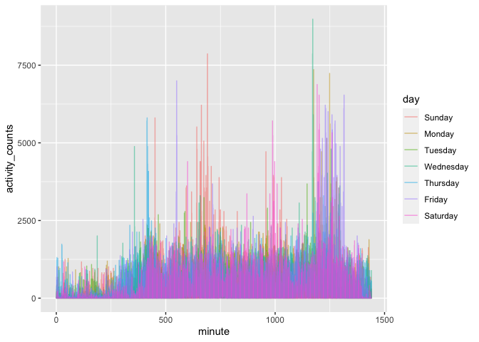
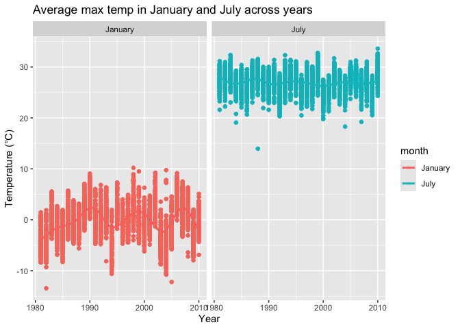

Homework 3
================
Chariz Seijo

Solution to HW 3.

## Problem 1

``` r
data("instacart")
```

This dataset contains 1384617 rows and 15 columns.

Observations are the levels of items in orders by user. There are
user/order variables, such as user ID, order ID, order day, and order
hour. There are also item variables, including name, aisle, department,
and some numeric codes.

**How many aisles, and which are most items from?**

``` r
instacart %>% 
  count(aisle) %>% 
  arrange(desc(n))
```

    ## # A tibble: 134 x 2
    ##    aisle                              n
    ##    <chr>                          <int>
    ##  1 fresh vegetables              150609
    ##  2 fresh fruits                  150473
    ##  3 packaged vegetables fruits     78493
    ##  4 yogurt                         55240
    ##  5 packaged cheese                41699
    ##  6 water seltzer sparkling water  36617
    ##  7 milk                           32644
    ##  8 chips pretzels                 31269
    ##  9 soy lactosefree                26240
    ## 10 bread                          23635
    ## # … with 124 more rows

**Make a plot\!**

``` r
instacart %>% 
  count(aisle) %>% 
  filter(n > 10000) %>% 
  mutate(
    aisle = factor(aisle),
    aisle = fct_reorder(aisle, n)
  ) %>% 
  ggplot(aes(x = aisle, y = n)) +
  geom_point() +
  theme(axis.text.x = element_text(angle = 90, vjust = 0.5, hjust=1))
```

<!-- -->

**Make a table\!**

``` r
instacart %>% 
  filter(aisle %in% c("baking ingredients", "dog food care", "packaged vegetables fruits")) %>% 
  group_by(aisle) %>%
  count(product_name) %>% 
  mutate(rank = min_rank(desc(n))) %>% 
  filter(rank < 4) %>% 
  arrange(aisle, rank) %>% 
  knitr::kable()
```

| aisle                      | product\_name                                 |    n | rank |
| :------------------------- | :-------------------------------------------- | ---: | ---: |
| baking ingredients         | Light Brown Sugar                             |  499 |    1 |
| baking ingredients         | Pure Baking Soda                              |  387 |    2 |
| baking ingredients         | Cane Sugar                                    |  336 |    3 |
| dog food care              | Snack Sticks Chicken & Rice Recipe Dog Treats |   30 |    1 |
| dog food care              | Organix Chicken & Brown Rice Recipe           |   28 |    2 |
| dog food care              | Small Dog Biscuits                            |   26 |    3 |
| packaged vegetables fruits | Organic Baby Spinach                          | 9784 |    1 |
| packaged vegetables fruits | Organic Raspberries                           | 5546 |    2 |
| packaged vegetables fruits | Organic Blueberries                           | 4966 |    3 |

**Apples vs. ice cream\!**

``` r
instacart %>% 
  filter(product_name %in% c("Pink Lady Apples", "Coffee Ice Cream")) %>% 
  group_by(product_name, order_dow) %>% 
  summarize(mean_hour = mean(order_hour_of_day)) %>% 
  pivot_wider(
    names_from = order_dow,
    values_from = mean_hour
  ) %>% 
  knitr::kable()
```

    ## `summarise()` regrouping output by 'product_name' (override with `.groups` argument)

| product\_name    |        0 |        1 |        2 |        3 |        4 |        5 |        6 |
| :--------------- | -------: | -------: | -------: | -------: | -------: | -------: | -------: |
| Coffee Ice Cream | 13.77419 | 14.31579 | 15.38095 | 15.31818 | 15.21739 | 12.26316 | 13.83333 |
| Pink Lady Apples | 13.44118 | 11.36000 | 11.70213 | 14.25000 | 11.55172 | 12.78431 | 11.93750 |

## Problem 2

**Load, tidy, and wrangle the accelerometer data.**

``` r
accel_df = 
  read_csv(
      "./data/accel_data.csv") %>%
  pivot_longer(
    activity.1:activity.1440,
    names_to = "minute",
    names_prefix = "activity.",
    values_to = "activity_counts"
  ) %>% 
  mutate(
    day = factor(day, 
                 levels=c("Sunday","Monday","Tuesday","Wednesday","Thursday","Friday","Saturday")),
    minute = as.numeric(minute),
    weekday = 
      ifelse(day %in% c("Saturday", "Sunday"), FALSE, TRUE)
  ) %>% 
  arrange(day)
```

This dataset includes five weeks of accelerometer data collected on a 63
year-old male who was diagnosed with congestive heart failure. It
contains 50400 observations and 6 variables. Variables in this dataset
include week of observation, each day of observation, day of the week,
minute of the day, activity counts, and whether each observation
happened on a weekday or weekend.

**Total activity by day**

``` r
accel_df %>% 
  group_by(day_id, day, week) %>% 
  summarize(total_activity = sum(activity_counts)) %>%
  knitr::kable()
```

| day\_id | day       | week | total\_activity |
| ------: | :-------- | ---: | --------------: |
|       1 | Friday    |    1 |       480542.62 |
|       2 | Monday    |    1 |        78828.07 |
|       3 | Saturday  |    1 |       376254.00 |
|       4 | Sunday    |    1 |       631105.00 |
|       5 | Thursday  |    1 |       355923.64 |
|       6 | Tuesday   |    1 |       307094.24 |
|       7 | Wednesday |    1 |       340115.01 |
|       8 | Friday    |    2 |       568839.00 |
|       9 | Monday    |    2 |       295431.00 |
|      10 | Saturday  |    2 |       607175.00 |
|      11 | Sunday    |    2 |       422018.00 |
|      12 | Thursday  |    2 |       474048.00 |
|      13 | Tuesday   |    2 |       423245.00 |
|      14 | Wednesday |    2 |       440962.00 |
|      15 | Friday    |    3 |       467420.00 |
|      16 | Monday    |    3 |       685910.00 |
|      17 | Saturday  |    3 |       382928.00 |
|      18 | Sunday    |    3 |       467052.00 |
|      19 | Thursday  |    3 |       371230.00 |
|      20 | Tuesday   |    3 |       381507.00 |
|      21 | Wednesday |    3 |       468869.00 |
|      22 | Friday    |    4 |       154049.00 |
|      23 | Monday    |    4 |       409450.00 |
|      24 | Saturday  |    4 |         1440.00 |
|      25 | Sunday    |    4 |       260617.00 |
|      26 | Thursday  |    4 |       340291.00 |
|      27 | Tuesday   |    4 |       319568.00 |
|      28 | Wednesday |    4 |       434460.00 |
|      29 | Friday    |    5 |       620860.00 |
|      30 | Monday    |    5 |       389080.00 |
|      31 | Saturday  |    5 |         1440.00 |
|      32 | Sunday    |    5 |       138421.00 |
|      33 | Thursday  |    5 |       549658.00 |
|      34 | Tuesday   |    5 |       367824.00 |
|      35 | Wednesday |    5 |       445366.00 |

This man appears to have noticeable dips in activity on the last two
Saturdays of observation. Activity counts also seem to be steady
throughout the week and fluctuate more often at the end of the week.

**Plot of total activity by day**

``` r
accel_df %>% 
 ggplot(aes(x = minute, y = activity_counts)) +
  geom_line(aes(color = day), alpha = .5)
```

<!-- -->

Based on this graph, we can conclude that there is noticeably less
activity during the night, and more activity during the day, with more
spikes recorded in the morning/evening.

## Problem 3

``` r
data("ny_noaa")
```

In the NY NOAA dataset, there are 7 columns and 2595176 rows. This
dataset includes weather data from New York state weather stations.

Variable description:

  - `id`: Weather station ID
  - `date`: Date of observation
  - `prcp`: Precipitation (tenths of mm)
  - `snow`: Snowfall (mm)
  - `snwd`: Snow depth (mm)
  - `tmax`: Maximum temperature (tenths of degrees C)
  - `tmin`: Minimum temperature (tenths of degrees C)

There are a total of 145,838 missing values in the precipitation
variable, 381,221 in snowfall, 591,786 in snow depth, 1,134,358 in
maximum temperature, and 1,134,420 in minimum temperature.

**Cleaning the data.**

``` r
noaa_df =
  ny_noaa %>%
  separate(date, c("year", "month", "day")) %>%
  mutate(
    year = as.numeric(year),
    month = as.numeric(month),
    day = as.numeric(day),
    prcp = as.numeric(prcp)*0.1,
    tmax = as.numeric(tmax)*0.1,
    tmin = as.numeric(tmin)*0.1
  )
```

For snow, the most commonly observed value is 0 at 2008508 observations.
Snow does not fall the majority of the year in the state of New York,
which supports 0 being the most commonly observed value.

**Average max temperature, January and July**

``` r
 noaa_tmax = noaa_df %>% 
  filter(month %in% c("1", "7")) %>% 
  group_by(id, year, month) %>% 
  mutate(
    avg_tmax = mean(tmax, na.rm = TRUE),
    month = month.name[month]
  )

ggplot(noaa_tmax, aes(x = year, y = avg_tmax, color = month)) +
  geom_point(alpha = 0.1) +
  geom_smooth(alpha = 0.1) +
  facet_grid(~ month) +
  labs(
    title = "Average max temp in January and July across years",
    x = "Year",
    y = "Temperature (°C)"
    )
```

<!-- -->

The observable structure demonstrates lower average max temperatures in
January (roughly -10°C to 10°C) and higher averaged max temperatures in
July (roughly 25°C to 30°C). There is more fluctuation in temperate in
January, and a few outliers below -10°C. There are outliers for July
with the lowest being about 14°C.

**Two-panel plot**

``` r
library(hexbin)
library(patchwork)

tmax_tmin = noaa_df %>% 
  ggplot(aes(x = tmin, y = tmax)) +
  geom_hex()
```

2-panel plot (make each plot, then figure out how to merge; first plot -
contour plot or bin plot; second plot - filter first, box plot or ridge
plot)

snow\_plot = noaa\_df %\>% filter(snow \> 0 & snow \< 100)
